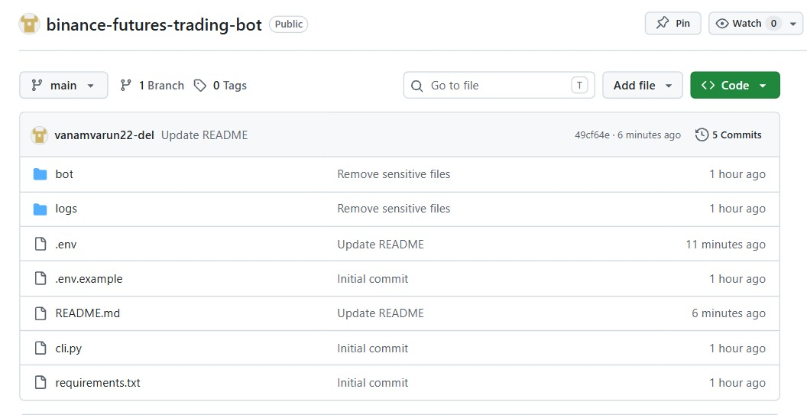
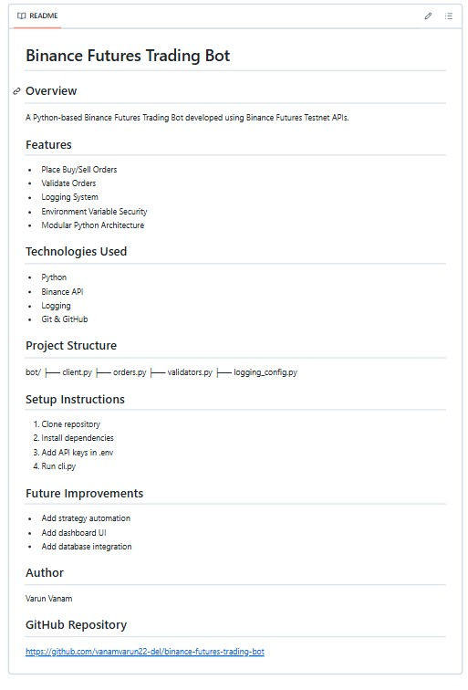
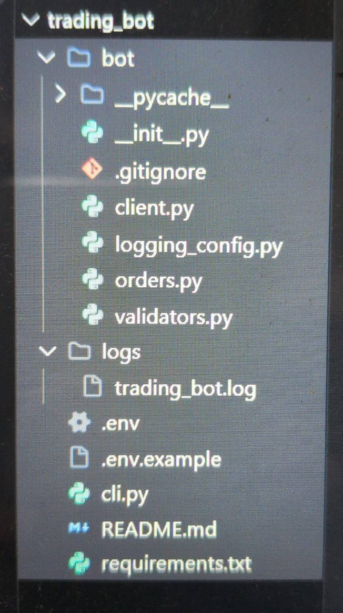
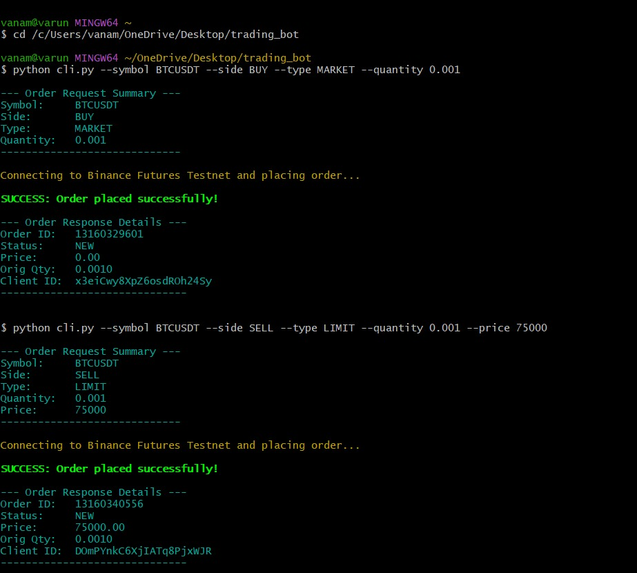

# Binance Futures Trading Bot

## Overview
A Python-based Binance Futures Trading Bot developed using Binance Futures Testnet APIs.

## Features
- Place Buy/Sell Orders
- Validate Orders
- Logging System
- Environment Variable Security
- Modular Python Architecture

## Technologies Used
- Python
- Binance API
- Logging
- Git & GitHub

## Project Structure
bot/
├── client.py
├── orders.py
├── validators.py
├── logging_config.py

## Setup Instructions
1. Clone repository
2. Install dependencies
3. Add API keys in .env
4. Run cli.py

## Future Improvements
- Add strategy automation
- Add dashboard UI
- Add database integration

## Author
Varun Vanam

## GitHub Repository
https://github.com/vanamvarun22-del/binance-futures-trading-bot

## Project Screenshots

### GitHub Repository

### GitHub Full Page

### VS Code Project Structure

### Terminal Output
